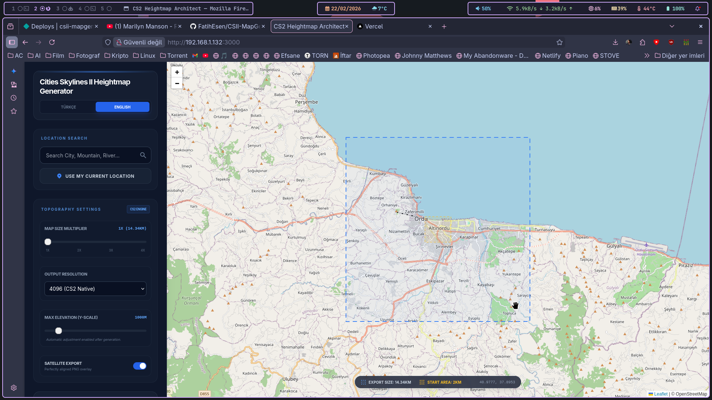

# 🗺️ MAPGEN PRO: Cities Skylines II Heightmap Generator 🚀
## *Precision Engineered. Global Scale. Ultra-Definition.*

Welcome to **MAPGEN PRO**, the ultimate geospatial acquisition tool for **Cities Skylines II**. Designed for professional map creators and realism enthusiasts, this tool bridges the gap between real-world topography and the CS2 engine with unparalleled precision.

---

## 🌟 Key Features (English)

### 💎 Ultra-Detail Super-Sampling (SS)
Don't settle for standard 4K. Our engine processes terrain data at **8K (8192px)** resolution and intelligently downsamples it to the game-native **4096px**. This results in the sharpest, most accurate heightmaps possible with built-in anti-aliasing.

### 🌍 World Map & Distant Terrain
Expand your horizon! Export not just the playable area, but also the **World Map (57.3km x 57.3km)**. Perfectly aligned with your main heightmap to ensure your horizons look as realistic as your city center.

### 📐 Extreme Multiplier (Up to 128x)
Whether you are building a small town or an entire province, our multiplier supports up to **128x** scale. Map entire countries (like Turkey) with a single click.

### ⛰️ Auto-Calibration Intelligence
Manual guesswork is over. The system automatically detects the peak elevations of your selected area and calibrates the **Height Scale** for you. Just import the value into CS2 and you have a 1:1 replica.

### 🛰️ Integrated Satellite Overlays
High-resolution satellite imagery perfectly aligned with your heightmap. Use it as an in-game guide for road networks, river banks, and forest placement.

---

## 🛠️ Technical Specs
*   **Resolution:** 4096px (Native) & 4096px (Ultra Detail SS)
*   **Depth:** 16-bit Grayscale RAW PNG
*   **Source:** AWS S3 Terrarium (High Detail Zoom 15) & ArcGIS Satellite
*   **Projection:** Precise WGS84 Web Mercator to CS2 Grid Mapping

---

# 🇹🇷 MAPGEN PRO: Cities Skylines II Yükseklik Haritası Oluşturucu

**MAPGEN PRO**, Cities Skylines II için geliştirilmiş, profesyonel seviyede bir coğrafi veri toplama aracıdır. Gerçek dünya topografyasını oyun motoruna 1:1 hassasiyetle aktarmak isteyen mimarlar ve harita tasarımcıları için tasarlandı.

---

## 🌟 Temel Özellikler (Türkçe)

### 💎 Ultra Detay - Süper Örnekleme (SS)
Standart 4K ile yetinmeyin. Sistemimiz veriyi **8K (8192px)** çözünürlükte işler ve oyunun tanıdığı **4096px** formatına akıllıca düşürür. Bu sayede en keskin hatlara ve sıfır hata payına sahip yükseklik haritaları elde edersiniz.

### 🌍 Dünya Haritası ve Uzak Arazi
Ufkunuzu genişletin! Sadece oynanabilir alanı değil, **Dünya Haritasını (57.3km x 57.3km)** da dışa aktarın. Ana haritanızla mükemmel şekilde hizalanan bu veri, ufuk çizginizin şehriniz kadar gerçekçi görünmesini sağlar.

### 📐 Devasa Ölçek Çarpanı (128x'e Kadar)
İster küçük bir kasaba, ister koca bir eyalet inşa edin. Ölçek çarpanımız **128x** seviyesine kadar destek sunar. Tek tıkla tüm Türkiye'yi kapsayacak kadar geniş alanları haritalandırın.

### ⛰️ Akıllı Yükseklik Kalibrasyonu
Manuel hesaplamalara son. Sistem, seçtiğiniz bölgedeki zirve noktalarını otomatik olarak algılar ve sizin için **Height Scale** değerini hesaplar. Bu değeri CS2 editörüne girmeniz yeterlidir.

### 🛰️ Entegre Uydu Katmanları
Yükseklik haritanızla birebir hizalanmış yüksek çözünürlüklü uydu görüntüleri. Oyun içinde yolları, nehir yataklarını ve ormanları yerleştirirken mükemmel bir rehber olarak kullanın.

---

## 📖 Kullanım Kılavuzu / Quick Start
1.  **Bölgenizi Seçin:** Arama çubuğunu veya "Konumumu Kullan" butonunu kullanın.
2.  **Detay Ayarlarını Yapın:** "Ultra Detay" ve "Dünya Haritası" seçeneklerini ihtiyacınıza göre aktif edin.
3.  **Veriyi Oluştur:** "Harita Verisi Oluştur" butonuna basın.
4.  **Dışa Aktar:** İndirilen dosyaları CS2 Map Editor'a yükleyin. **Önemli:** Önizleme panelinde size verilen `Height Scale` değerini oyun içindeki editöre girmeyi unutmayın!

---
*Created with ❤️ for the Cities Skylines II Community.*
